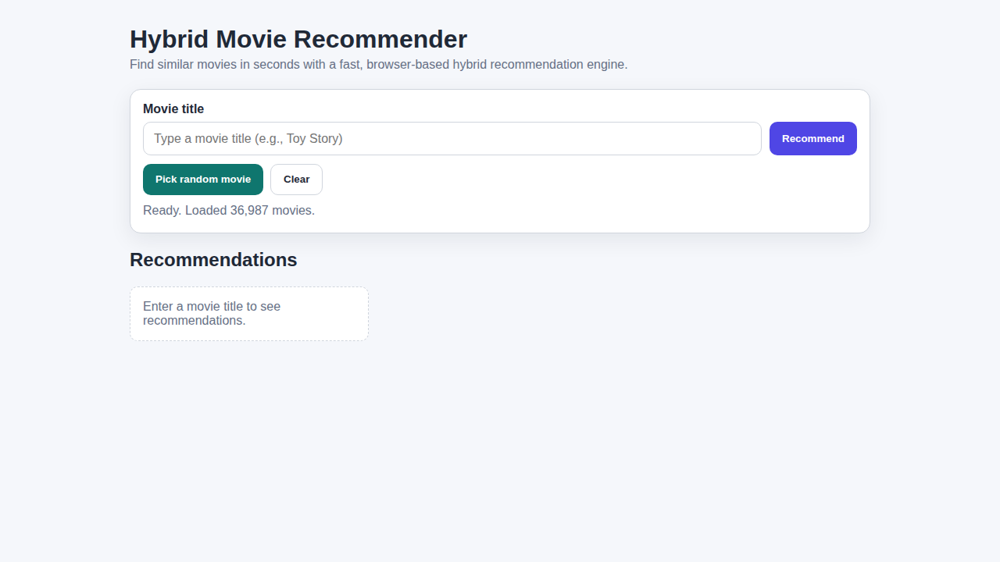
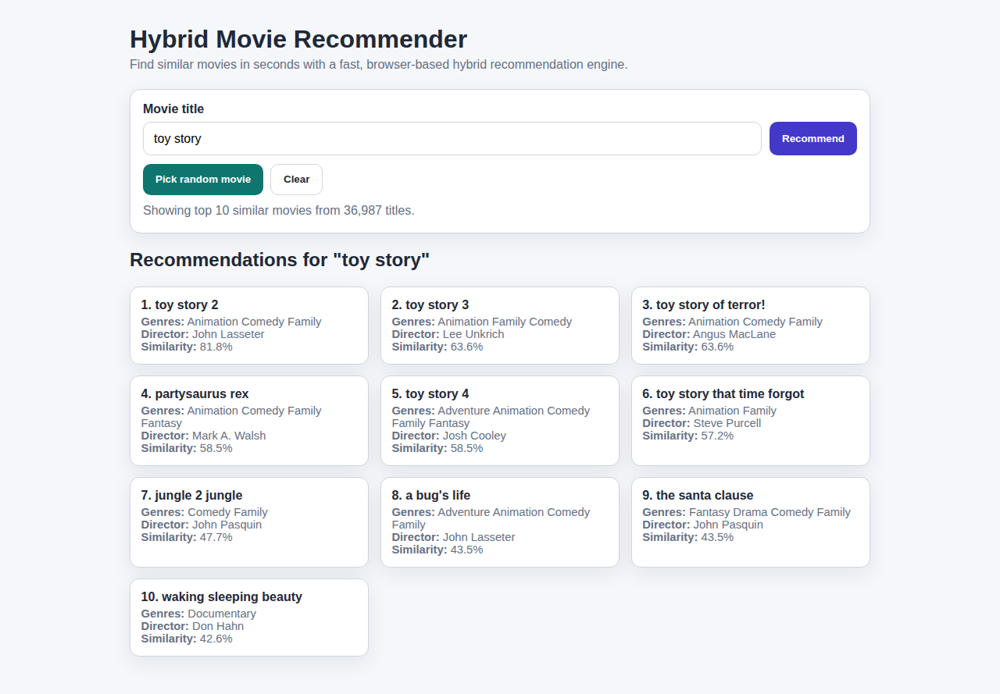
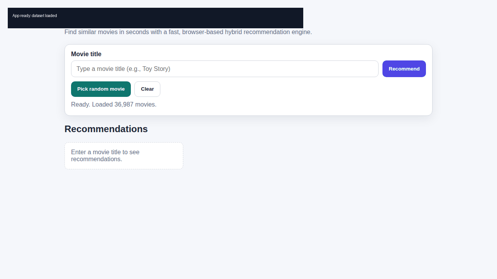

# Hybrid Movie Recommendation System (Production Web App)

A production-ready movie recommendation web app that uses a hybrid feature representation (`comb`) from the project dataset and runs fully in the browser (no backend required for inference).

## Live Deployment

- **GitHub Pages URL (target):** `https://darren-2000.github.io/Hybrid-Movie-Recommendation-System/`
- **Deployment workflow:** `.github/workflows/deploy-pages.yml`
- **Trigger:** push to `main` (or manual run via GitHub Actions)

> If you do not see the site yet, the deployment workflow is not on `main` yet or has not completed successfully.

---

## Why this version is production-oriented

This repo was upgraded from a research-style codebase to a deployable product experience:

- ✅ Static web app for easy hosting and wide compatibility
- ✅ Better UX (search, random pick, clear/reset, status messaging)
- ✅ Safer rendering (HTML escaping to prevent script injection from data)
- ✅ Multi-path dataset loading (`./main_data.csv` and `../main_data.csv`) for both Pages and local `/web/` mode
- ✅ GitHub Pages CI deployment workflow
- ✅ Repo hygiene (`.gitignore` for generated Python artifacts)
- ✅ Media-rich documentation (screenshots + short demo GIFs)

---

## Product Screenshots

### Home / Ready State


### Recommendation Results


---

## Short Demo Videos (GIF)

### Recommendation Flow


### Quick Demo


---

## App Features

- Hybrid-style recommendation behavior using token overlap from `comb`
- Title search with suggestions (`datalist`)
- Random movie exploration
- Top-N recommendations with similarity score
- Responsive UI for desktop and mobile
- Error states for unknown titles and dataset loading failures

---

## Repository Structure

```text
.
├── web/
│   ├── index.html
│   ├── styles.css
│   └── app.js
├── main_data.csv
├── .github/workflows/deploy-pages.yml
├── app.py                      # legacy Flask artifact
└── movie.ipynb                 # experimentation notebook
```

---

## Run Locally

From the repository root:

```bash
cd /home/runner/work/Hybrid-Movie-Recommendation-System/Hybrid-Movie-Recommendation-System
python -m http.server 8000
```

Then open either:

- `http://localhost:8000/` (if you copy `web/*` to root manually), or
- `http://localhost:8000/web/` (supported by dataset fallback path logic)

---

## GitHub Pages Setup

1. Open **Settings → Pages** in your GitHub repository.
2. Under **Build and deployment**, choose **GitHub Actions**.
3. Ensure `.github/workflows/deploy-pages.yml` exists on `main`.
4. Push to `main` (or run **Deploy GitHub Pages** manually from Actions).
5. Wait for workflow completion, then open:
   - `https://darren-2000.github.io/Hybrid-Movie-Recommendation-System/`

---

## How to verify deployment is running

1. Go to **Actions** tab in GitHub.
2. Open the latest **Deploy GitHub Pages** run.
3. Confirm all jobs are green.
4. Open the `page_url` shown in the deploy step output.
5. Confirm UI shows:
   - `Ready. Loaded XX,XXX movies.`

---

## Known Operational Notes

- First load parses ~36k rows client-side; initial load can take a few seconds on slower devices.
- Recommendations are based on token overlap in the dataset feature column (`comb`), not user-authenticated personalization.
- `Procfile` and `app.py` are legacy server artifacts; static Pages app is the recommended production path.

---

## Data

- Dataset file: `main_data.csv`
- Key columns used by web app:
  - `movie_title`
  - `genres`
  - `director_name`
  - `comb`

---

## Research Reference

Conference paper:
https://www.researchgate.net/publication/389884094_Movie_Recommendation_System_using_Hybrid_filtering

---

## Author

**MORRIS DARREN BABU**  
M.S. Data Science  
B.E. Computer Science  
Department of Computer Science  
Friedrich-Alexander-University Erlangen-Nürnberg, Germany
