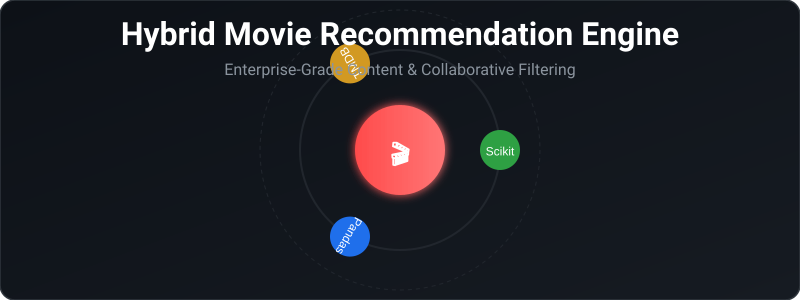
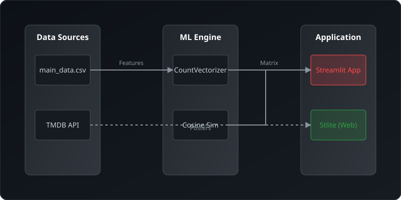

<div align="center">
  

  <p align="center">
    <strong>Discover your next favorite movie instantly with an enterprise-grade hybrid filtering engine.</strong>
  </p>

  <p align="center">
    <a href="https://github.com/DARREN-2000/Hybrid-Movie-Recommendation-System/actions"></a>
    <a href="https://python.org"></a>
    <a href="https://streamlit.io"></a>
    <a href="https://scikit-learn.org"></a>
    <a href="LICENSE"></a>
  </p>
</div>

<br />

The **Hybrid Movie Recommendation System** combines the speed of local-first data processing with the power of modern machine learning techniques (Content-Based and Collaborative Filtering). Built entirely in Python, it provides hyper-personalized movie suggestions while overcoming the classic cold-start problem common in traditional recommendation engines.

> 📚 **Read the Full Documentation**: [Explore the Docs](docs/index.md)

---

## ⚡ Core Features

- **Hybrid Filtering Pipeline**: Uses `CountVectorizer` and `cosine_similarity` to process a highly curated string of metadata (genres, actors, directors) to calculate precise vector distances.
- **Dual-Mode Operation**:
  - *Local Mode*: Runs instantly off a pre-processed dataset. No internet required.
  - *Live Global Engine*: Integrates with the TMDB API to fetch rich metadata and movie posters on the fly.
- **WASM-Ready**: Architecture allows for execution directly in the browser via `stlite`, making static hosting (GitHub Pages, Cloudflare) a breeze.
- **Fuzzy Input Matching**: Leverages `difflib` to gracefully handle user typos and incomplete movie titles.

---

## 🏗️ Architecture Overview

The system is designed with a clear separation of concerns, ensuring high maintainability and testability.

<div align="center">
  
</div>

<details>
<summary><strong>View Detailed Component Breakdown</strong></summary>

### 1. Data Tier
- **`main_data.csv`**: A pre-processed, verified IMDB dataset optimized for feature extraction.
- **TMDB API**: An external fallback for fetching rich media.

### 2. Processing Engine (Scikit-Learn)
- Loads the dataset via Pandas.
- Converts textual metadata into a Sparse CSR Matrix.
- Calculates Cosine Similarity in real-time upon user request.

### 3. Application Tier (Streamlit)
- Provides a reactive, responsive UI.
- Routes data and caches heavy operations using `@st.cache_data` and `@st.cache_resource`.

</details>

For a deeper dive, read the [Architecture Documentation](docs/architecture.md).

---

## 🚀 Quick Start

### 1. Local Development (Standard Python)

```bash
# 1. Clone the repository
git clone https://github.com/DARREN-2000/Hybrid-Movie-Recommendation-System.git
cd Hybrid-Movie-Recommendation-System

# 2. Install requirements
pip install -r requirements.txt

# 3. Run the application
streamlit run app.py
```

Navigate to `http://localhost:8501` to start discovering movies.

### 2. Enable Rich Media (Optional)
To display movie posters, provide a TMDB API Key. You can enter this via the UI sidebar, or set it as an environment variable:
```bash
export DEFAULT_TMDB_API_KEY="your_tmdb_api_key_here"
```

For more deployment options (including serverless), view the [Deployment Guide](docs/deployment.md).

---

## 📂 Project Structure

```text
.
├── app.py                # Main Streamlit application and ML logic
├── index.html            # WebAssembly stlite configuration for edge deployment
├── main_data.csv         # Core dataset
├── requirements.txt      # Python dependencies
├── test_app.py           # Pytest unit tests
├── .github/              # GitHub Actions and Issue Templates
└── docs/                 # Extensive project documentation
    ├── assets/           # High-quality SVG diagrams
    └── diagrams/         # Mermaid.js source diagrams
```

---

## 🤝 Contributing

We believe in open source. Whether it's a bug fix, new feature, or documentation improvement, we welcome your contributions!

Please review our [Contributing Guidelines](CONTRIBUTING.md) and [Code of Conduct](CODE_OF_CONDUCT.md) before submitting a Pull Request.

---

## 🛡️ Security and Support

- **Security**: If you discover a vulnerability, please read our [Security Policy](SECURITY.md).
- **Support**: Check our [Support Guide](SUPPORT.md) if you need help troubleshooting an issue.

---

## 📄 License and Acknowledgements

This project is licensed under the MIT License - see the [LICENSE](LICENSE) file for details.

- Data provided by **IMDB** and verified via **Wikipedia**.
- Application framework by [Streamlit](https://streamlit.io/).
- Client-side execution via [Stlite](https://github.com/whitphx/stlite).
- Academic Foundation: [Conference Paper on Hybrid Filtering](https://www.researchgate.net/publication/389884094_Movie_Recommendation_System_using_Hybrid_filtering) by Morris Darren Babu.
